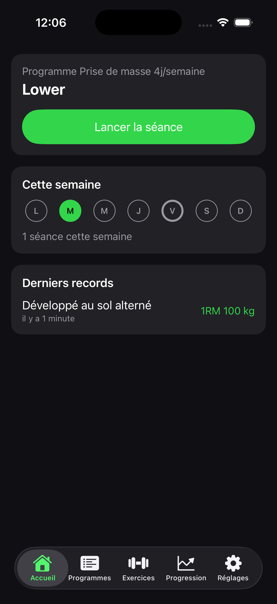
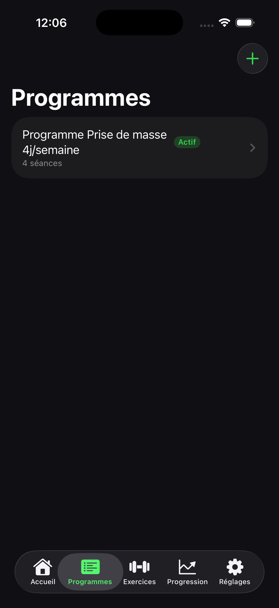
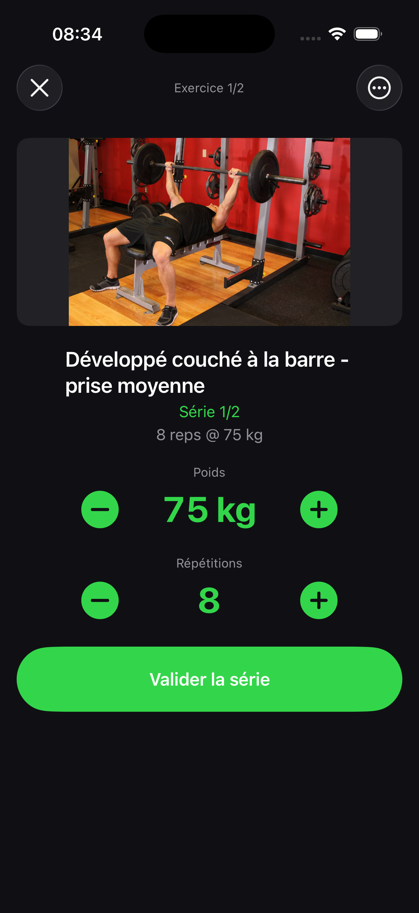
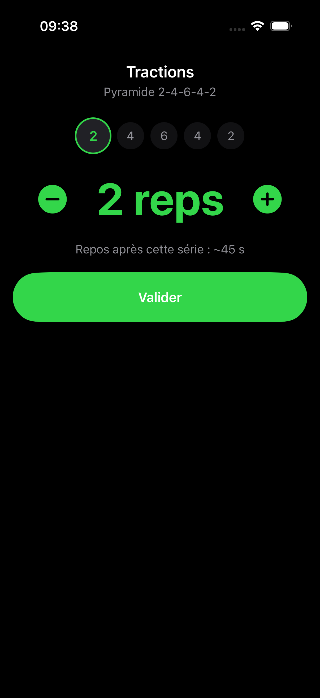
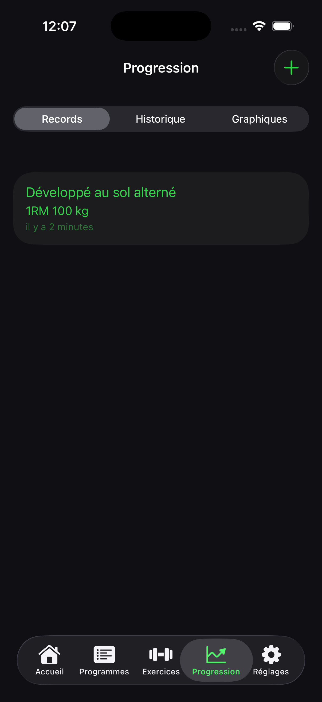

# Muscu

Application iOS native de musculation, sombre et épurée, pour un usage personnel en
salle comme à la maison. Elle permet de créer des programmes d'entraînement, de
dérouler ses séances en direct avec un chrono de repos adaptatif, et de suivre sa
progression (records, 1RM, historique, graphiques). Toutes les données
personnelles restent hors ligne ; seules les images d’exercices sont téléchargées
à la demande depuis un snapshot public épinglé, puis mises en cache.

## Fonctionnalités

- **Profil** (facultatif) : objectif, niveau, matériel, jours disponibles, durée
  de séance, zones à ménager, unité d'affichage et **paliers de chargement
  réellement disponibles**. Le générateur et les règles de progression s'y
  adaptent ; l'application reste utilisable sans profil.
- **Programmes** : trois façons de construire un programme.
  - **Manuel** : création libre, séance par séance, exercice par exercice.
  - **Modèles** : splits classiques prêts à l'emploi (Full Body, Upper/Lower, PPL,
    Arnold...), éditables ensuite (remplacement d'exercice, séries, répétitions).
  - **Générateur** : un questionnaire (objectif, expérience, jours par semaine,
    durée de séance, matériel disponible, muscles prioritaires, zones à éviter)
    produit un programme complet et cohérent, prévisualisable avant import.
    Il peut aussi produire un **plan de 4 à 16 semaines** daté, avec
    périodisation linéaire, ondulatoire ou constante et semaines de décharge.
    Chaque choix est expliqué avant enregistrement, et le programme est vérifié
    par un validateur local (matériel, niveau, exclusions, zones à ménager,
    bornes de volume, récupération, durée estimée).
- **Planification et adaptation** :
  - **Plan** : calendrier des semaines et des séances datées, déplacement d'une
    séance et marquage (prévue, terminée, partielle, ignorée, reportée). Le
    planning ne modifie jamais l'historique déjà enregistré.
  - **Avant la séance** : check-in facultatif (énergie, sommeil, courbatures,
    stress, douleur) et suggestion expliquée. Une douleur déclenche un message
    prudent invitant à consulter un professionnel — jamais un diagnostic.
  - **Progression expliquée** : huit règles sélectionnables (double progression,
    charge fixe, répétitions, séries, % du 1RM, cible de RIR, lesté/assisté,
    temporelle). Chaque proposition cite les performances qui la justifient,
    n'est appliquée qu'après votre accord, et reste **annulable** depuis le
    journal d'adaptation.
- **Séances en direct** : saisie rapide poids/répétitions, chrono de repos
  automatique avec notifications, reprise après interruption (kill de l'app en
  pleine séance).
- **Formats d'exercices** — tous pilotés par une machine à états unique
  (`MuscuEngine.WorkoutStateMachine`), reprenable à n'importe quelle transition :
  - **Classique** : séries/répétitions standard, avec suggestion de charge
    (progression de +2,5 kg après validation du haut de fourchette, dernière
    performance ou pourcentage du 1RM connu).
  - **Superset, triset, giant set, circuit** : exercices enchaînés A1 → A2 → …,
    repos court entre exercices et repos de fin de tour distincts, tour et
    exercice courants affichés, reprise exacte après fermeture de l'app.
  - **Dropset** : 1 à 5 paliers de baisse de charge, en pourcentage ou en kg,
    cumulatifs et arrondis au palier de chargement réellement disponible.
  - **Rest-pause** et **myo-reps** : série principale puis mini-séries, avec
    seuil d'arrêt, maximum configurable et arrêt manuel.
  - **Pyramide** : montée/descente de répétitions avec **repos adaptatif** calculé
    selon l'intensité relative de la série qui vient d'être faite.
  - **Intervalles** et **EMOM** : blocs travail/repos chronométrés.
  - **AMRAP** : un maximum de répétitions dans un temps donné.
  - **For Time** : travail fixe, temps mesuré, plafond de temps facultatif.
  - **Échauffement** : montée en charge automatique avant l'exercice principal.
- **Saisie détaillée d'une série** (facultative, repliée par défaut) : effort
  ressenti (RIR), échec musculaire, commentaire, tempo et type de charge
  (externe, poids du corps, lesté, assisté) avec convention unilatérale.
- **Progression et suivi** : records par exercice (1RM estimé via la formule
  d'Epley, max de répétitions), détection automatique des performances battues en
  fin de séance, historique complet des séances.
  - **Tableaux de bord** : volume et séries difficiles par muscle et par semaine,
    tonnage, fréquence, adhérence au planning, répartition musculaire avec
    alertes de déséquilibre, comparaison de périodes, évolution par exercice
    (1RM estimé, charge max, répétitions, tonnage). Chaque graphique indique son
    **unité, sa période, sa formule** et le nombre de séries dont la donnée
    manque — « zéro » et « donnée absente » ne sont jamais confondus. Chacun
    expose une alternative textuelle lue par VoiceOver.
  - **Mesures corporelles** : poids, tours de taille/poitrine/bras/cuisse et
    autres, avec date, unité, source et commentaire.
  - **Objectifs** : fréquence, séries hebdomadaires par muscle ou poids visé,
    échéance facultative, avancement factuel, mise en pause et archivage sans
    réécrire l'historique.
  - Les records sont **typés** (charge, 1RM estimé, répétitions, tonnage, temps,
    tours) et **spécifiques à leur configuration** : un AMRAP de 8 minutes n'est
    jamais comparé à un AMRAP de 12 minutes, et une traction assistée ne crée
    jamais de faux record.
  - L'historique distingue explicitement exercices, tours et sous-séries.
- **Mes données** (Réglages) : export CSV séparé (séances, séries, mesures,
  check-in) en plus de l'export JSON complet, et **suppression par catégorie ou
  totale**, qui rend compte de ce qui a réellement été supprimé.
  - L'import propose **Fusionner** ou **Remplacer**. Le remplacement crée
    d'abord une sauvegarde de sécurité et restaure automatiquement si l'import
    échoue : rien n'est irréversible.
- **Multi-appareils** : application universelle iPhone / iPad / Mac Catalyst,
  avec onglets en largeur compacte et barre latérale en largeur régulière
  (raccourcis ⌘1–⌘5). Les deux présentations affichent les mêmes écrans.
  - La **synchronisation iCloud** est implémentée en local-first : file
    d'attente persistante, backoff, tombstones, conflits visibles et
    diagnostic exportable sans donnée personnelle. Elle est **désactivée tant
    qu'un conteneur CloudKit n'a pas été configuré** — voir
    [docs/configuration/icloud.md](docs/configuration/icloud.md). L'application
    fonctionne intégralement hors ligne sans elle.
- **Catalogue** : 873 exercices en français (nom, muscles, matériel, catégorie,
  instructions, image), recherche insensible aux accents, exercices personnalisés.
- **Hors ligne et sauvegarde** : aucun compte, aucun serveur - toutes les données
  restent sur l'iPhone (SwiftData). Export/import JSON complet depuis les Réglages
  (programmes, historique, records, exercices personnalisés, réglages et séance
  active) avec validation et aperçu avant confirmation.
  - Format d'archive **v3** : enveloppe `{ version, exportedAt, manifest, payload }`
    dont le manifeste porte les compteurs par type et une somme de contrôle SHA-256
    du contenu. Une archive tronquée ou modifiée est refusée avant toute écriture.
  - Les archives **v1 et v2** restent importables ; les champs absents prennent une
    valeur neutre plutôt qu'une valeur devinée.
  - L'import est **idempotent** : réimporter la même sauvegarde ne crée aucun doublon.

## Captures d'écran

| Accueil | Programmes | Séance | Pyramide | Progression |
|---|---|---|---|---|
|  |  |  |  |  |

## Stack technique

- **SwiftUI** (iOS 18 minimum), thème sombre forcé, navigation adaptative
  (onglets en compact, barre latérale en régulier) sur iPhone, iPad et Mac Catalyst.
- **SwiftData** pour toute la persistance utilisateur (programmes, historique,
  records, séance en cours, profil, mesures, check-in, planning). Le schéma est
  versionné (`MuscuSchemaV1` → `V2` → `V3`) avec un plan de migration testé sur
  des stores figés : cf. `docs/decisions/0001-schema-v3-et-migrations.md`.
- **MuscuEngine** : package Swift Package Manager séparé (`Packages/MuscuEngine`)
  qui porte toute la logique métier pure et testable, sans dépendance à SwiftUI ni
  SwiftData : catalogue d'exercices, générateur de programme, calcul du 1RM,
  pyramide et repos adaptatif, intervalles, échauffement, ainsi que les règles
  transversales du modèle v3 — types de charge et calculs associés (`SetMetrics`),
  unités (le **kilogramme** est la valeur canonique stockée), tempo et RPE/RIR,
  politique de fusion pour la synchronisation — ainsi que toute la
  programmation : machine à états du déroulé (`WorkoutStateMachine`), moteur de
  progression, périodisation, détection de plateau, conseil de forme et
  validateur de programme.
- Interface et contenu entièrement en français.

## Build

### MuscuEngine (bibliothèque Swift, tests unitaires)

```bash
cd Packages/MuscuEngine
DEVELOPER_DIR=/Applications/Xcode.app/Contents/Developer swift test
```

### Application iOS

Le projet Xcode est généré par [XcodeGen](https://github.com/yonaskolb/XcodeGen)
à partir de `project.yml` (le `.xcodeproj` n'est pas versionné) :

```bash
xcodegen generate
DEVELOPER_DIR=/Applications/Xcode.app/Contents/Developer xcodebuild \
  -project Muscu.xcodeproj -scheme Muscu \
  -destination 'platform=iOS Simulator,name=iPhone 17' \
  clean build
```

Pour lancer dans le simulateur : ouvrir `Muscu.xcodeproj` dans Xcode, ou installer
le `.app` généré via `xcrun simctl install`.

## Structure du projet

```
App/
  Sources/
    Models/         Entités SwiftData (Program, Prescription, Records, WorkoutLog...)
    Features/        Home, Programs, Workout, Exercises, Progress, Settings
    Services/        Export/import JSON, cache d'images, chrono de repos, détection de records
    MuscuApp.swift, RootTabView.swift, Theme.swift
  Resources/
    Assets.xcassets  Icône de l'app
Packages/
  MuscuEngine/       Package SPM : catalogue, générateur de programme, 1RM,
                     pyramide, intervalles, échauffement, règles du modèle v3
                     (Domain/, Runner/, Programming/, Analytics/, Sync/)
                     - 261 tests unitaires
Tests/
  Fixtures/          Stores SwiftData figés (migration) et exports v1/v2 (import)
docs/
  roadmap/           Plan produit complet et plan d'exécution par phases
  decisions/         Journal des décisions d'architecture et de migration
  configuration/     Étapes externes requises (conteneur iCloud, signature)
  superpowers/       Spécification de design et plan d'implémentation
  screenshots/       Captures d'écran utilisées dans ce README
project.yml          Définition du projet Xcode (source de vérité, via XcodeGen)
```

## Statut

Le produit livré aujourd'hui couvre les 5 onglets, les 4 formats de séries
(classique, pyramide, intervalles, AMRAP), l'échauffement, le chrono de repos,
les records/historique/graphiques et l'export/import.

La suite du développement suit `docs/roadmap`, phase par phase. L'avancement
réel est tenu à jour dans [docs/roadmap/09-execution-plan.md](docs/roadmap/09-execution-plan.md) :
une case n'est cochée que lorsque tous les critères de la phase sont vérifiés.

Avant une diffusion publique, il reste à signer l'application avec le compte
développeur choisi, valider une archive Release sur un iPhone physique et
effectuer les vérifications administratives App Store.
